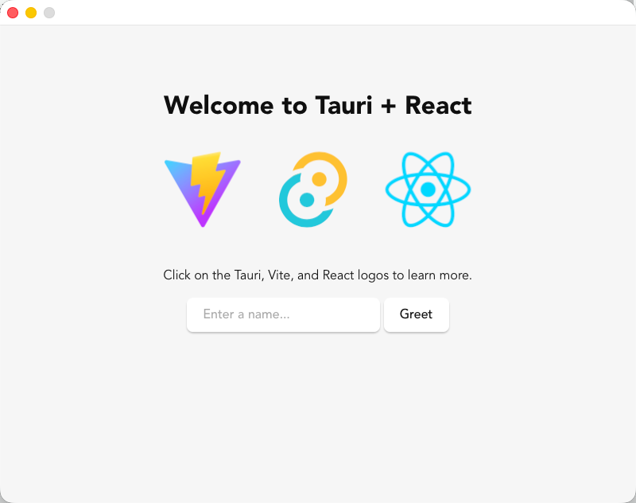

# mano-app

This project attempts to implement a novel writing application based on the GPUI framework.

## Current Progress

One line of "Hello World" has been written, success is just around the corner 😂.

# GPUI-WRY

GPUI-Wry attempts to combine [GPUI](https://www.gpui.rs/) with [Tauri](https://tauri.app/).

## Project Introduction

GPUI-Wry is like a "mini Tauri" that allows developers to build part of the UI using frontend apps while leveraging GPUI for the main GUI logic. The framework combines:

- **[GPUI](https://www.gpui.rs/)**: A Rust library for building GUI applications.
- **[GPUI Component](https://longbridge.github.io/gpui-component/)**: gpui-component implements a Webview component for GPUI based on Wry.
- **[Wry](https://github.com/tauri-apps/wry)**: A cross-platform Webview wrapper library.

With this combination, during GPUI development, you can embed WebViews anywhere in native windows.

GPUI-Wry aims to implement some of Tauri's capabilities, such as calling Rust functions from Webviews, to enable interaction between the two UI types.
However, much of this work is just beginning.

Some Tauri code has been copied during implementation, which may not be standard practice. License declarations will be added in the future.
Special thanks to Tauri for the inspiration.

## Running Examples

The project includes an example application, very similar to Tauri's default example, which you can run with the following command:

Before you to run the example, you need to install the frontend app.
Go to the [directory of the example greet](examples/apps/greet) and run:

```shell
pnpm install
```

To run the example, run at the root of the project:

```bash
# Run the greet example
cargo run --example greet
```



---

<p align="center">Made with ❤️ using Tauri and GPUI</p>
